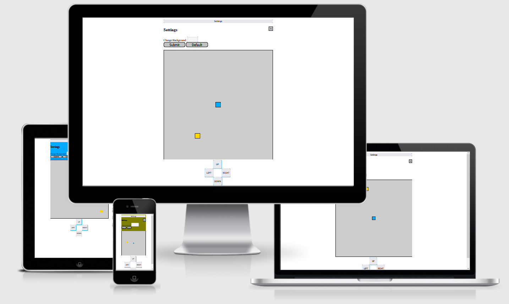

# **Snake Arena**

A Snake game for the easy fun of not dying while eating and you can change the background color of the page! 

Play the game: https://no0tno0t.github.io/snake/

 

## **Table of Contents**
* [**Planning Stage**](#planning-stage)
  * Project Goals
  * User Goals
  * User Stories
  * Design Goals
  * Design Choices
    * Font
    * Color Scheme
  * Wireframes
* [**Features**](#features)
  * Customisation
* [**Future Features to be Added**](#future-features-to-be-added)
* [**Testing**](#testing)
  * Responsiveness
  * Lighthouse
    * Desktop
  * Validators
* [**Bugs**](#bugs)
  * Fixed Bugs
  * Known Bugs
* [**Technology Used**](#technology-used)
  * Languages
  * Libraries
* [**Deployment**](#deployment)
* [**Credits**](#credits)
  * Content
  * Media
  * Thanks

## **Planning Stage**

### Project Goals
The goal with this project were to build an immersive version of snake with lots of different game features. The lowest goal-level were to build a game with a dpad-controller. 

### User Goals
Grand goal were to have the user be excited for a version of snake where there is hidden levels so to never stop playing!

Lowest goal targets the one who doesnt want to do anything but need to focus on the smallest of game so not to be distracted from doing nothing. 

 ### User Stories
 * As a user I want the site to be easy to use and easy to navigate.
 * As a user I want the freedom in a customizable layout.
 * As a user I want there to be a story.  

 ### Design Goals
 * A simple minimilistic site that works on all devices.
 * Customisation options.
 * Customizable controls.
 * Different snake skins.

### Design Choices
 
 #### Font
 A font that doesn't obstruct any of the ease to use the site.

 #### Color Scheme
 I put on a color that goes along with the snake and food colors in the game. They have high contrast with black font which worked well. 

### Wireframes
I did draw wireframes on paper but the grand hopes were to mimic the style of a Nintendo Gameboy and Nintendo Switch. 

## **Features**

### Controls
The game is customized for keyboard buttons WASD and arrow buttons. The direction pad, dpad, also works. 

## **Features to be added**
The world is open for this one. Some features I would like to do or see:
* hidden features that for example show up after a specifik amount of consumed foods.
* sudden snake rival in a pokemon setup that then need some attack and escape feature
* new area unlock

 ## **Testing**
 The game has been tested on Firefox and Chrome with no issues found. 

 ### Responsiveness
 The site is fully responsive.

 ### LightHouse

 ## Desktop
 

  ### **Validators**
  HTML

CSS

## **Bugs**
The dpad does sometimes get distorted. It should be a fixed Bug but it would be good with further testing before clearing it. 

## **Technology Used**

### Languages
 * HTML
 * CSS
 * JavaScript

### Libraries

 ## **Deployment**
I deployed the website on GitHub pages:

You can play the game here: https://no0tno0t.github.io/snake/

## **Credits**

### Content
*  Web Dev Simplified, https://www.youtube.com/watch?v=QTcIXok9wNY
*  https://css-tricks.com/inheriting-box-sizing-probably-slightly-better-best-practice/

### Thanks
* [Richard Wells](https://github.com/D0nni387) - Code Institute mentor.
* [Luke Gibson](https://github.com/gibbo101) - Code Institute student and former Snakegame-builder.

